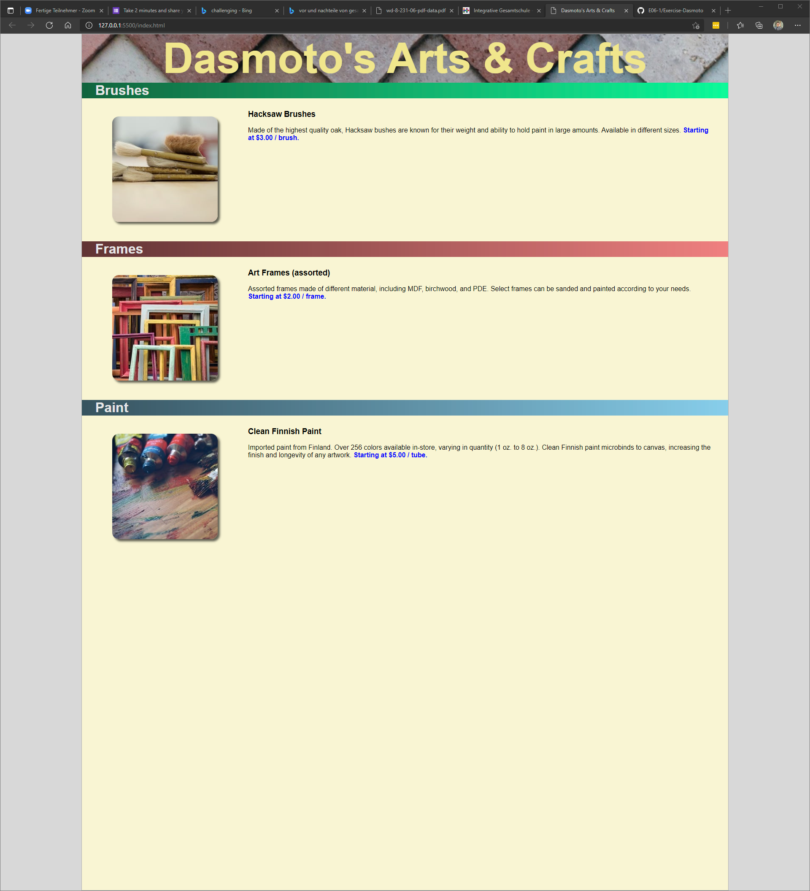

# Goal of this Exercise

Try to recreate the Website displayed in the Picture. Try to use semantic HTML together with everything you learned so far. Make it look like the example as close as possible.
